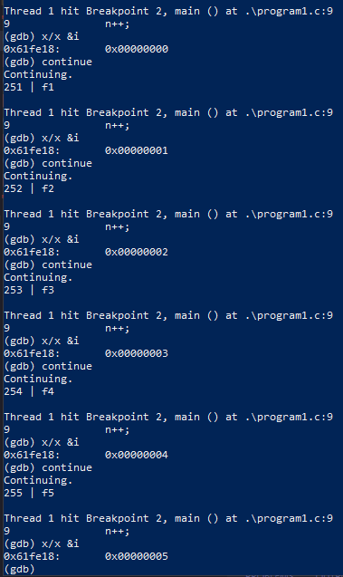

# Week 2

### 1) Copy the aforementioned codes and save them into individual files (e.g. intergeroverflow.c). Identify what the programs do.

I called them programs 1 to 4

### 2) Compile them using the following command: gcc -o integeroverflow integeroverflow.c -w -g. The “-w” flag inhibits issues that are noted by the compiler (there shouldn’t be any for this programme, but we will use it later - you should NEVER compile code with the “-w” flag set in the future). The “-g” flag provides some extra help when investigating the executable file in the debugging/disassembling software that we are going to use - gdb.

All exe files are compiled like this

### 3) Run the programmes and observe the outputs.
Did this ( take screenshots)

### 4) Open the executable files in the gdb environment using: gdb integeroverflow. Once in the environment we can “list” the program code, set execution breakpoints, run the code and look at the contents of the registers using the following:
>list\
>break x //where x is a line number\
>run //run the code up to the break point\
>continue //continue to execute the code after the break point\
>info register //show the contents of the registers\
>x/x &i //show the memory contents for the variable i\

### 5) Using gdb look at the memory to identify what is happening when an integer overflows/wraps around